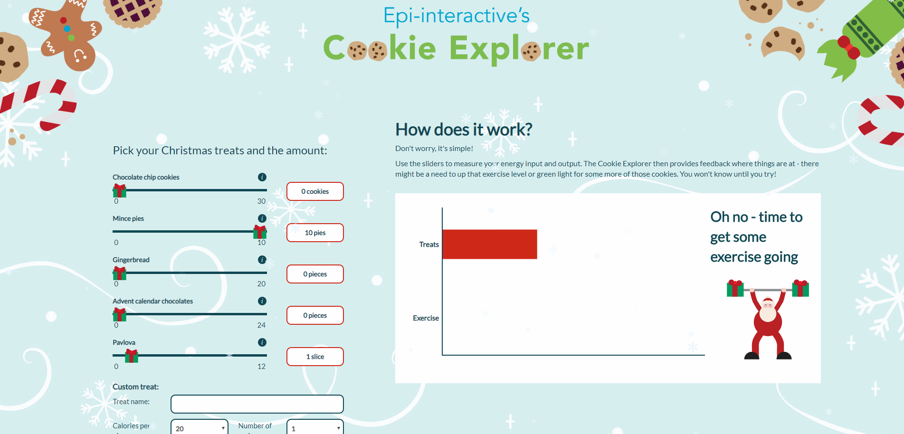

# Custom Theming

An R Shiny application for tracking your treats and exercises over the Christmas period. We created this app for our 2018 Christmas game and it shows how you can custom-theme sliders and other UI elements. It also demonstrates how you can blend in images based on reactive values and add hovers to it.

See it in action <a href="https://shiny.epi-interactive.com/cookie-explorer" target="_blank">here</a>



## Our customisation

*  Slider images
*  Animated plots
*  Themed loading spinners

As well as extending standard Shiny components like:

*  Alerts and feedback
*  Tooltips and modals

### Slider images
Customise your slider markers by adding a custom `background-image`.
``` css

.irs-slider {
      background-image: url(../img/Icons/Exercise_presents.svg);
}
```

### Animate plots 
We use [Plotly](https://plot.ly/) for our charts. Add CSS animations to bring them to life.
``` css 
.trace.bars g.point path {
  transform: scaleX(0);
  animation: extend-bar 1s forwards ease;
}
```

### Themed loading spinners
Listen out for the `shiny-busy` lifecycle event to add an overlay for when the app is loading. Shiny attaches a `.shiny-busy` class for this.
We use [Plotly](https://plot.ly/) for our charts. Add CSS animations to bring them to life.
``` css 
.shiny-busy #loadingOverlay{
    opacity: 1;
    visibility: visible;
}
```


---

Code created by [Epi-interactive](https://www.epi-interactive.com) 

As always, our expert team is here to help if you want custom training, would like to take your dashboards to the next level or just need an urgent fix to keep things running. Just get in touch for a chat.

[https://www.epi-interactive.com/contact](https://www.epi-interactive.com/contact)
